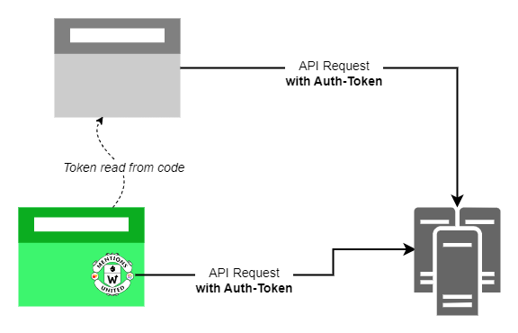
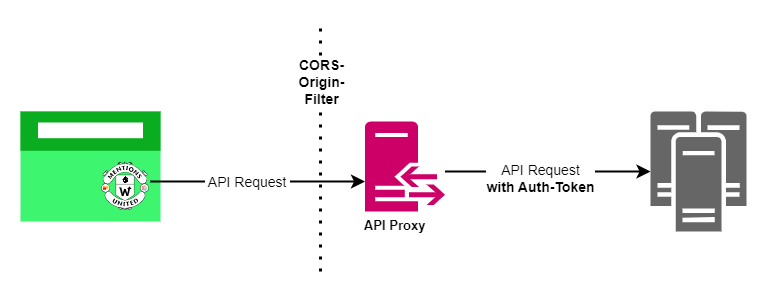

<p align="right" style="margin-bottom:0">
  
  
</p>

# Mentions United API-Proxy

**Proxy Node.js/Express app to hide public API keys of calls from Mentions United Provider plugins**

In most cases, using APIs from Internet services also means having to authenticate yourself in some way before retrieving the data. This is often done by first registering with the service as a user and then generating an access key or token that is sent in the header with the request.

In server-side programming languages, where API access takes place from server to server, these keys are usually stored in configuration files that cannot be accessed by anyone other than the developers themselves.

This is somewhat more difficult with **JavaScript-driven client applications**, as it is also possible to communicate with an API server via a key, but it must be stored readably in the code and is also downloaded to the client when the app is displayed in the browser. Anyone who is allowed to use the app is therefore able to extract the key and thus obtain data from the service.



In the [**Mentions United**](https://github.com/kristofzerbe/Mentions-United) project, which performs client-side fetching and rendering of interactions from the web, and which was implemented entirely as client-side JavaScript, some of the providers require these tokens for API access.

When using the relevant Mentions United Provider, you can decide to leave the token readable in the code, but as an alternative, this small **Node.js/Express-based proxy** was created, which does nothing more than forward a request to the target API with the token appended, which is stored in a **protected environment variable**.



The proxy mechanism is not self-written, but uses the package [**http-proxy-middleware**](https://www.npmjs.com/package/http-proxy-middleware).

The forwarding of the request is therefore basically a two-liner (without line breaks ;) if it is ensured that the URL called is the same as that of the  target API, but only has a different domain ... plus a path under which the proxy has its endpoint, but which is removed again before forwarding.

Requesting  
\> https://**myproxy.domain**/***example***/api/v1/statuses/12345  
leads to a call for data from  
\> https://**example.com**/api/v1/statuses/12345  

```js
const exampleProxy = createProxyMiddleware({
  target: process.env.EXAMPLE_API_URL,
  changeOrigin: true,
  pathRewrite: (path, req) => { return path.replace("/example", ""); },
  headers: { Authorization: "Bearer " + process.env.EXAMPLE_API_TOKEN }
});
app.use('/example', exampleProxy);
```

In order to prevent this proxy from being used by everyone, the incoming requests are filtered via the CORS options to defined permitted URLs.

## Environment Variables

The proxy app supports .ENV files for local testing. Just create a new empty file in the cloned or downloaded project all name it ``.env``. 

The following settings are mandatory:

| Name  | Description |
| --- | --- |
| **PORT** | Port number the app listens (default = 3000) |
| **LOG** | Output of the proxied URL's (true/false) |
| **CORS_URLS** | Comma-separated list of allowed base URL's<br>(e.g: "http://localhost:4000,https://kiko.io") |

## Providers

The implementation has been slightly refactored in the current version, as they do not differ for each provider. The list of providers in the ``app.js`` currently contains:

- **pixelfed**
- **mastodon**

Required environment variables for each provider:

| Name  | Description |
| --- | --- |
| *&lt;**PROVIDERNAME**&gt;***_API_URL** | Base URL of the Pixelfed instance<br>(e.g. "https://pixelfed.social") |
| *&lt;**PROVIDERNAME**&gt;***_API_TOKEN** | Read-Only Bearer Token / Access Token |

Every provider has a menu item 'Development' or 'Applications' somewhere in the account settings, where you can generate an appropriate access token. With Pixelfed, for example, this is under *Settings > Applications > Personal Access Tokens*

## Hosting

There are some hosting services for Node.js/Express apps, but you should choose one that does not shut down unused resources after a while, otherwise the requests may time out or the user of the page who is supposed to see the Mentions United Interactions has to wait too long.

The first productive **Mentions United API-Proxy** for the blog [kiko.io](https://kiko.io) is hosted at [Railway](https://railway.app).
